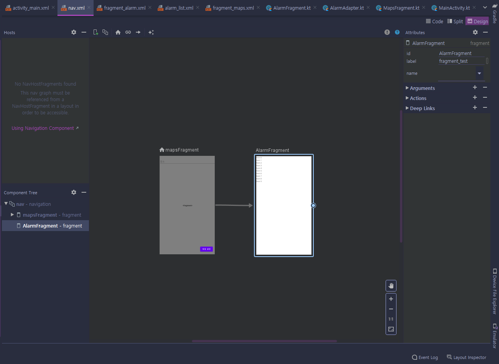
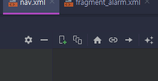

# ANDROID
## Jetpack
### DataBinding
- gradle 설정
  ~~~
    android {
       buildFeatures {
            dataBinding = true
        } 
    }
  ~~~
  ~~~
  <layout>

    <data>
        <variable
            name="tripList"
            type="com.example.프로젝트 이름.<dataclass이름>" />
    </data>
  </layout>
  ~~~
- xml코드에 `<layout>`으로 시작한다.
- 양방향 데이터 바인딩을 지원한다.

### ViewBinding
- gradle 설정
  ~~~
    android {
       buildFeatures {
            viewBinding = true
        } 
    }
  ~~~
- 뷰 바인딩 무시 속성을 추가 할 수 있다.
- `DataBinding`보다 컴파일 시간이 더 빠르다 
### Navigation
#### 기능
- 프래그먼트 트랜잭션 처리.
- 기본적으로 '위로'와 '뒤로' 작업을 올바르게 처리.
- 애니메이션과 전환에 표준화된 리소스 제공.
- 딥 링크 **(앱 내의 특정 대상으로 직접 이동할 수 있게 하는 링크)** 구현 및 처리.
- 최소한의 추가 작업으로 탐색 UI 패턴(예: 탐색 창, 하단 탐색) 포함.
- Safe Args - 안드로이드 내비게이션 간 안정적인 매개변수 사용을 위해 쓰이는 라이브러리
- ViewModel 지원 - 탐색 그래프에 대한 ViewModel을 확인해 그래프 대상 사이에 UI 관련 - 데이터를 공유합니다.

#### 사용법
```xml
<androidx.fragment.app.FragmentContainerView
        android:id="@+id/nav_host_fragment"
        android:name="androidx.navigation.fragment.NavHostFragment"
        android:layout_width="0dp"
        android:layout_height="0dp"
        app:layout_constraintLeft_toLeftOf="parent"
        app:layout_constraintRight_toRightOf="parent"
        app:layout_constraintTop_toTopOf="parent"
        app:layout_constraintBottom_toBottomOf="parent"

        app:defaultNavHost="true"
        app:navGraph="@navigation/<navigationXML파일>" />
```
* ```app:defaultNavHost="true"```는 하나의 ```NavHost```만 기본값으로 지정할 수 있다.

* 창이 2개인 레이아웃도 한 호스트만 NavHost로 지정해야 합니다.



* +모양이 있는 아이콘을 클릭하면 새로운 **destination**을 만들 수 있습니다.
* 홈모양이 있는 아이콘을 클릭하면 선택중인 **Fragment**가 시작되는 **Fragment**로 설정됩니다.
```kt
binding!!.setting.setOnClickListener {
             findNavController().navigate(R.id.action_mapsFragment_to_AlarmFragment) 
        }
```
* 코틀린에서는 위처럼 ```findNavController()```메서드로 이동을 할 수 있습니다.