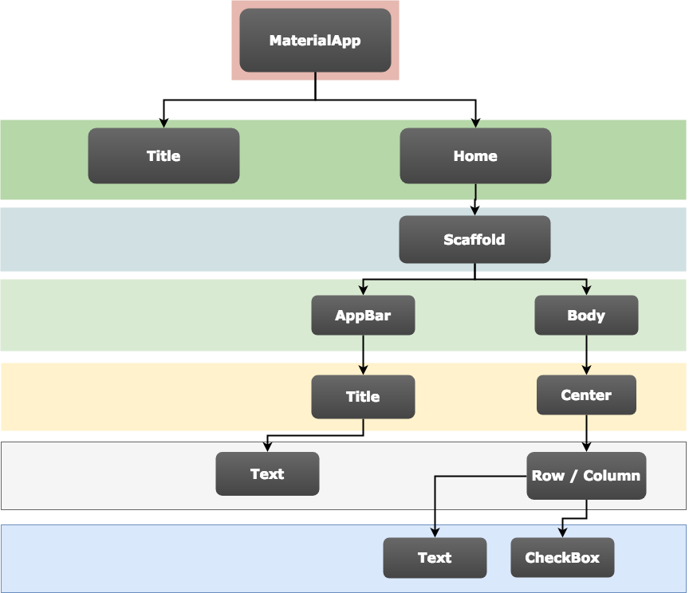
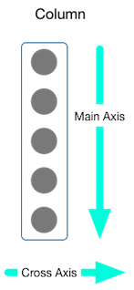

# 플러터 
## 에러 발생
```! Some Android licenses not accepted. To resolve this```
1. Open your terminal
2. type flutter doctor --android-licenses
3. press y to accept every license.
## 플러터 위젯 계층 

## UI 위젯 트리 다이어그램

## 위젯 정렬
 
## 문법
row로 ```textField``` 사용시 width 조정이 필요하다.
```Navigator.push()```를 통해 새로운 route로 전환 할 수 있다.
현재 루트에서 ```Navigator.pop()```으로 이전 루트로 빠져나갈 수 있다.
## 레이아웃 만들기
아이템을 수평으로 정렬 ```row``` 위젯
아이템을 수직으로 정렬 ```Column``` 위젯
남은 공간 모두 채우는  ```Expanded``` 위젯


## 웹 빌드
최신 버전의 플러터 sdk를 사용하고 웹 지원
~~~ 
flutter channel beta
flutter upgrade
flutter config --enable-web
~~~

웹 지원
~~~
flutter create <myapp> OR .
cd myapp
~~~

웹 빌드
~~~
flutter build web
~~~
## 알고 있으면 좋을 것 같은 것
```navigator```은 Last in First Out 방식으로 스택을 관리한다
